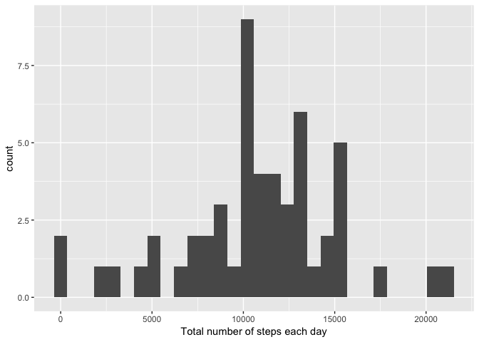
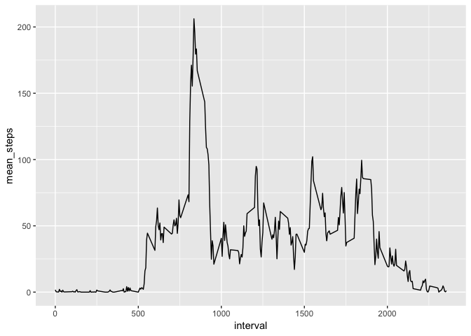
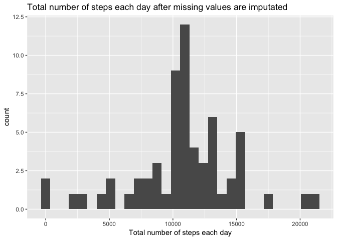
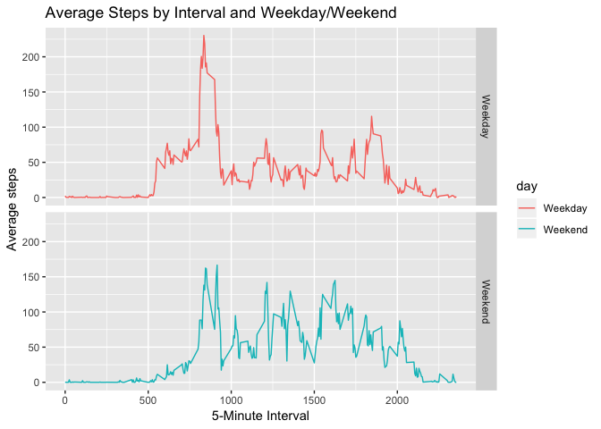

Week 2 Course Project 1
=========================
install and library packages

```r
library(tidyverse)
```

```
## ── Attaching packages ──────────────────────────────────────────── tidyverse 1.2.1 ──
```

```
## ✔ ggplot2 3.1.0     ✔ purrr   0.2.4
## ✔ tibble  1.4.2     ✔ dplyr   0.7.4
## ✔ tidyr   0.7.2     ✔ stringr 1.3.0
## ✔ readr   1.1.1     ✔ forcats 0.3.0
```

```
## Warning: package 'tidyr' was built under R version 3.3.2
```

```
## Warning: package 'readr' was built under R version 3.3.2
```

```
## Warning: package 'purrr' was built under R version 3.3.2
```

```
## Warning: package 'dplyr' was built under R version 3.3.2
```

```
## ── Conflicts ─────────────────────────────────────────────── tidyverse_conflicts() ──
## ✖ dplyr::filter() masks stats::filter()
## ✖ dplyr::lag()    masks stats::lag()
```

```r
library(ggplot2)
library(dplyr)
```

1. Load data activity.csv

```r
activity<-read.csv("activity.csv")
activity_nna<-activity %>% 
  na.omit()
str(activity)
```

```
## 'data.frame':	17568 obs. of  3 variables:
##  $ steps   : int  NA NA NA NA NA NA NA NA NA NA ...
##  $ date    : Factor w/ 61 levels "2012-10-01","2012-10-02",..: 1 1 1 1 1 1 1 1 1 1 ...
##  $ interval: int  0 5 10 15 20 25 30 35 40 45 ...
```

```r
summary(activity)
```

```
##      steps                date          interval     
##  Min.   :  0.00   2012-10-01:  288   Min.   :   0.0  
##  1st Qu.:  0.00   2012-10-02:  288   1st Qu.: 588.8  
##  Median :  0.00   2012-10-03:  288   Median :1177.5  
##  Mean   : 37.38   2012-10-04:  288   Mean   :1177.5  
##  3rd Qu.: 12.00   2012-10-05:  288   3rd Qu.:1766.2  
##  Max.   :806.00   2012-10-06:  288   Max.   :2355.0  
##  NA's   :2304     (Other)   :15840
```

```r
activity_byday<-activity_nna %>% 
    group_by(date) %>% 
    summarise(sum_steps=sum(steps))
```

2. Histogram of the total number of steps taken each day

```r
ggplot(data=activity_byday,aes(x=sum_steps)) +
  geom_histogram()+
  xlab("Total number of steps each day")
```

```
## `stat_bin()` using `bins = 30`. Pick better value with `binwidth`.
```

<!-- -->
  
3. Mean and median number of steps taken each day

```r
mean<-mean(activity_byday$sum_steps)
median<-median(activity_byday$sum_steps)
paste("Mean number of steps each day is", mean, sep=" ")
```

```
## [1] "Mean number of steps each day is 10766.1886792453"
```

```r
paste("Median number of steps each day is", median, sep=" ")
```

```
## [1] "Median number of steps each day is 10765"
```
4. Time series plot of the average number of steps taken

```r
activity_interval<-activity_nna %>% 
    group_by(interval) %>% 
    summarise(mean_steps=mean(steps))
ggplot(data=activity_interval,aes(x=interval, y=mean_steps)) +
  geom_line()
```

<!-- -->

5. The 5_minute interval that contains the max number of steps

```r
max_steps<-max(activity_interval$mean_steps)
max_interval<-activity_interval[activity_interval$mean_steps==max_steps,]$interval
paste('Max steps is', max_steps, sep=" ")
```

```
## [1] "Max steps is 206.169811320755"
```

```r
paste('Max interval is',max_interval, sep=" ")
```

```
## [1] "Max interval is 835"
```

6. Imputing missing data
Since there are missing data for some of the days, it is not feasible to impute the missing values with the mean steps that day. So I use the mean steps for the 5-minute interval. The data is available in activity_merge dataset.

```r
#number of rows with missing values
nrow(activity)-nrow(activity_nna)
```

```
## [1] 2304
```

```r
#merge the dataset with mean steps for the 5 minute interval with the original dataset
activity_merge<-merge(activity,activity_interval)
#Relace NA with the mean steps for the 5 minute interval
activity_merge$steps[is.na(activity_merge$steps)]<-activity_merge$mean_steps[is.na(activity_merge$steps)]
```

7. Histogram of total number os steps taken after imputation of missing values

```r
activity_byday2<-activity_merge %>% 
    group_by(date) %>% 
    summarise(sum_steps=sum(steps))
ggplot(data=activity_byday2,aes(x=sum_steps)) +
  geom_histogram()+
  xlab("Total number of steps each day")+
  ggtitle("Total number of steps each day after missing values are imputated")
```

```
## `stat_bin()` using `bins = 30`. Pick better value with `binwidth`.
```

<!-- -->

```r
#mean and median total number of steps per day
mean(activity_byday2$sum_steps)
```

```
## [1] 10766.19
```

```r
median(activity_byday2$sum_steps)
```

```
## [1] 10766.19
```

```r
# mean and median total number of steps per day are different from that calculated before missing values have been imputed
```

8. Panel plot comparing the average number of stps taken per 5-minute interval across weekdays and weekends

```r
#add new variable "day" with two levels-"Weekday" and "Weekend"
activity_merge$weekday<-weekdays(as.Date(activity_merge$date))
activity_merge$day<-ifelse(activity_merge$weekday=="Saturday"|activity_merge$weekday=="Sunday","Weekend","Weekday")
#calculate average steps by interval and weekday/weekend
activity_new<-activity_merge %>% 
    group_by(day,interval) %>% 
    summarise(mean_steps=mean(steps))
#make the plot
ggplot(data=activity_new,aes(x=interval, y=mean_steps,color=day)) +
  geom_line() +
  facet_grid(day ~ .)+
  labs(title="Average Steps by Interval and Weekday/Weekend", x="5-Minute Interval", y="Average steps")
```

<!-- -->

